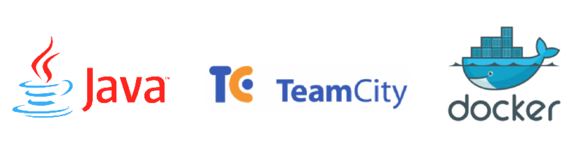
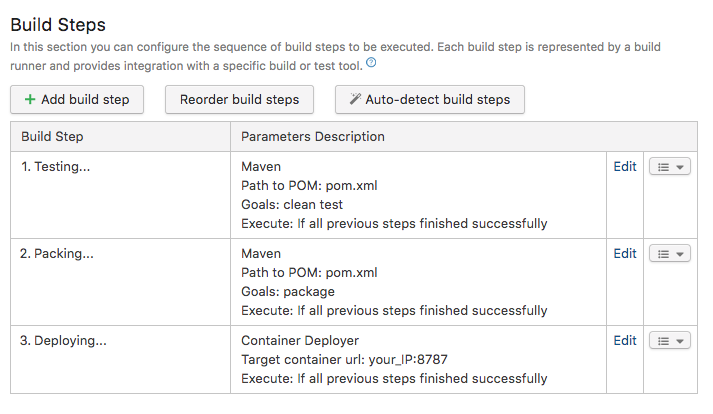
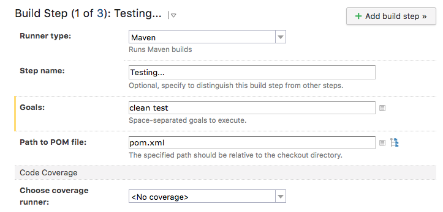
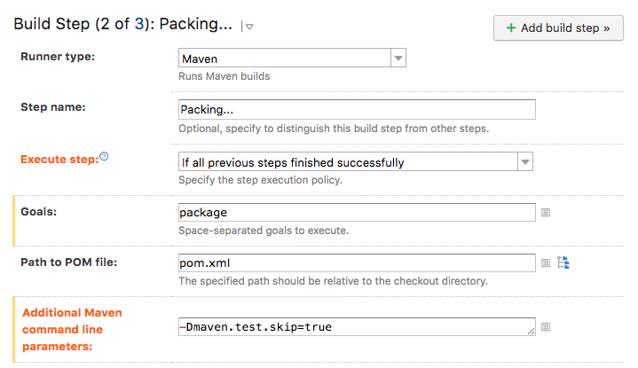
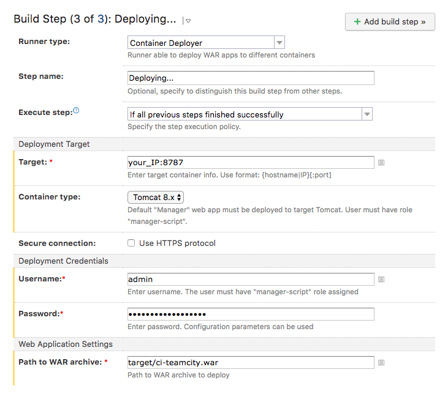

## CI with Java, TeamCity, and Dokcer

#### Java REST App
Here is the Docker command to run the java app with a Tomcat 8.0 server. Please take care that we have to use Java 1.7 because of this specifical Tomcat version. I added the .war copy command to deployed automatically. 
```sh
docker run --rm -v /your_path/ci-teamcity/target/ci-teamcity.war:/usr/local/tomcat/webapps/ci-teamcity.war -it -p 8585:8080 --name=tomcat tomcat:8.0
```

If you need to check the deployment, logs, or setup of Tomcat container use this command:
```sh
docker exec -it tomcat /bin/bash
```

Test the app going to:
```sh
http://localhost:8585/ci-teamcity
```
I added two more rest services a dummy hello call */javatest/hello* and a test/id validation *test/error*.

#### TeamCity Server 
First create two folders */data* and */logs* to storage what TC needs. This image will take a while to download (current local size used: 1.52GB).
```sh
docker run -it --name tcserver -v /your_path/teamcity/data:/data/teamcity_server/datadir -v /your_path/teamcity/logs:/opt/teamcity/logs -p 8111:8111 jetbrains/teamcity-server
```
I'm using the internal HSQLDB database provided by the image to avoid futher setup, if you have time use an external option!

#### TeamCity Agent 
There is two version for agents standar and minimal, I used the standard one, you can try with the minimal both will work fine. The standard version is a heavy image to download, so be patient (current local size used: 1.03GB).
```sh
docker run --name tcagent -it -e SERVER_URL="your_ip:8111" -p 9090:9090 -v /your_path/teamcity/agent:/data/teamcity_agent/conf jetbrains/teamcity-agent
```
TeamCity Agents will not work with *localhost* as SERVER_URL, so please use your IP. If you need to change your IP or your network connection, don't forget to update the *serverUrl* inside buildAgent.properties then restart the docker.
```sh
docker start tcagent
```

#### Adding local agent to the server
For the final step, you have to authorize manually your local agent here:
```sh
http://localhost:8111/agents.html?tab=unauthorizedAgents
```

#### TeamCity Setup

##### Create a new project
You can build from an URL, GitHub, Bitbucket, VisualStudioTeam, and a manually configurated repository. Here we are going to use GitHub. You will we asked to connect with your account, then select the repository. It's possible to build the same code in different TeamCity projects, for example master and QA branches. After you select the repository, you need to setup the  build steps. 


##### Clean-Test

With this setup it will being executed the unit test configured in the source and by the configuration in the pom.xml file. I'm using Junit 4.12 version.

##### Package

After being successfully executed the test, we create a .war file to be deployed. 

You can access the artifact created in TeamCity overview page. 

##### Deploy

In the new version of TeamCity is possible to deploy the artifact created or the result of a previous step. Here we are setting up a deploy in a Tomcat container running locally. 

#### Local Tomcat container

To deploy locally, we are going to use the same Tomcat 8.0 image from the beginning, but adding context and user setup. Go to */tomcat* folder and then build the Dockerfile.
```sh
docker build -t twogg/tomcat .
```
Now run the container, we are using admin/admin as user and password, and 8787 is going to be our deploy port for TeamCity.
```sh
docker run -d -p 8787:8080 --name tctomcat twogg/tomcat
```
